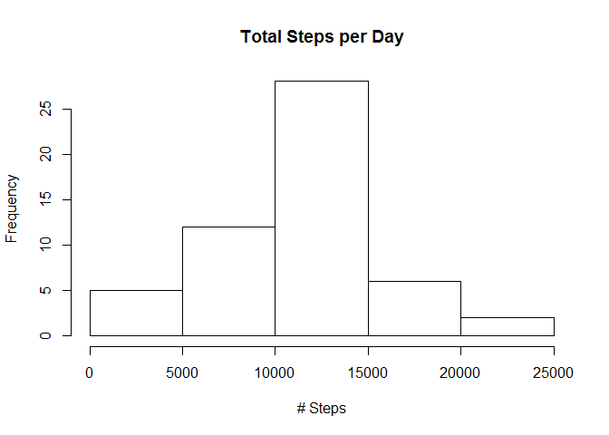
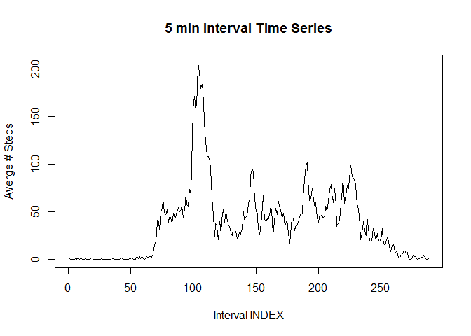
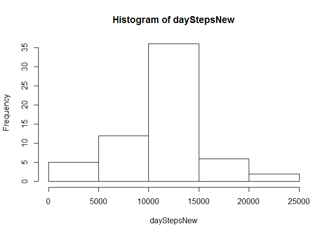

# Reproducible Research: Peer Assessment 1


## Loading and preprocessing the data


```r
##use english regional settings
Sys.setlocale("LC_TIME", "English")
```

```
## [1] "English_United States.1252"
```

```r
data <- read.csv(unz("activity.zip", "activity.csv"))
##subset all the complete cases
completes<- subset(data, complete.cases(data)==T)
```

## What is mean total number of steps taken per day?
### Histogram of the total number of steps taken each day

```r
##split on days
splitByDay <- split(completes, completes$date, drop=T)
## calculate steps taking everyday
daySteps <- sapply(splitByDay, function(x) sum(x$steps))

summary(daySteps)
```

```
##    Min. 1st Qu.  Median    Mean 3rd Qu.    Max. 
##      41    8841   10760   10770   13290   21190
```

```r
## draw the hist
hist(daySteps,main="Total Steps per Day", xlab="# Steps")
```

 

### Calculate and report the mean and median of the total number of steps taken per day

```r
mean(daySteps)
```

```
## [1] 10766.19
```

```r
median(daySteps)
```

```
## [1] 10765
```


## What is the average daily activity pattern?
### A time series plot of the 5-minute interval

```r
splitByInterval<- split(completes, completes$interval, drop=T)
intervalAvg<- sapply(splitByInterval, function(x) mean(x$steps))
plot(intervalAvg, type="l", main="5 min Interval Time Series", ylab="Averge # Steps", xlab="Interval INDEX")
```

 

### 5-minute interval which contains max number of steps

```r
intervalMax<-names(which.max(intervalAvg))
```
The interval "835" contains the maximum number of steps

## Imputing missing values
### Calculate and report the total numer of missing values in the dataset

```r
notCompleted <- subset(data, complete.cases(data)==F)
numberNotCompleted<-nrow(notCompleted)
```
Number of misssing values 2304

### Fill in the missing values using 5-minute interval data

```r
options(warn = -1) #turn of the warning
##copy data to new data frame
missingData <- notCompleted
## apply over very steps row containing NA and subset the rounded step mean from intervalAvg data
missingData[1]<- lapply(missingData[1], 
                    function(x) 
                            if(is.na(missingData$steps)&
                                       subset(intervalAvg,names(intervalAvg)==missingData$interval))
                                        {
                                                round(intervalAvg)
                                        }
                    )
options(warn = 1) #turn warnings back on

newData <- rbind(missingData, completes)
##split on days
splitByDayNew <- split(newData,newData$date, drop=TRUE)
## calculate steps taking everyday
dayStepsNew <- sapply(splitByDayNew, function(x) sum(x$steps))
## draw the hist
hist(dayStepsNew)
```

 

### Calculate and report the mean and median of the total number of steps taken per day after missing values are removed

```r
mean(dayStepsNew)
```

```
## [1] 10765.64
```

```r
median(dayStepsNew)
```

```
## [1] 10762
```


## Are there differences in activity patterns between weekdays and weekends?

```r
newData$date <- as.Date(strptime(newData$date, format="%Y-%m-%d"))

newData$day <- weekdays(newData$date)                              
for (i in 1:nrow(newData)) {                                       
    if (newData[i,]$day %in% c("Saturday","Sunday")) {             
        newData[i,]$day<-"weekend"                                 
    }
    else{
        newData[i,]$day<-"weekday"                                
    }
}

## aggregate newData by steps as a function of interval + day  
dayTypeIntervalSteps <- aggregate(newData$steps ~ newData$interval + newData$day, newData, mean)
colnames(dayTypeIntervalSteps) <- c("Interval", "DayType", "Steps")

## plot weekday over weekend time series
library("lattice")

xyplot(
    type="l",
    data=dayTypeIntervalSteps,
    Steps ~ Interval | DayType,
    xlab="Interval",
    ylab="Number of steps",
    layout=c(1,2)
)
```

 
